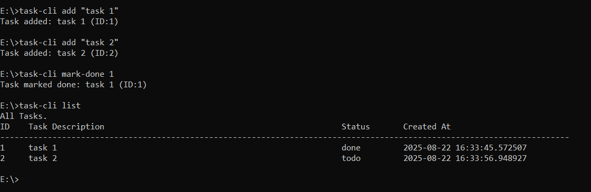

# 🧩 Task CLI — Simple Task Tracker

A command-line application to manage your to-do tasks efficiently.

## 🚀 Features

- ✅ Add new tasks
- ✏️ Update existing tasks
- ❌ Delete tasks
- 🔄 Mark tasks as done or in-progress
- 📋 List tasks (with optional filters)
- 💾 JSON file storage — no external DB needed!

## 📦 Installation

### Option 1: Install via GitHub (for now)

````bash
pip install git+https://github.com/AliBeiti/Task_Tracker_CLI.git

### Option 2: From local folder (for dev use)

```bash
git clone https://github.com/AliBeiti/Task_Tracker_CLI.git
cd Task_Tracker_CLI
pip install .

````


